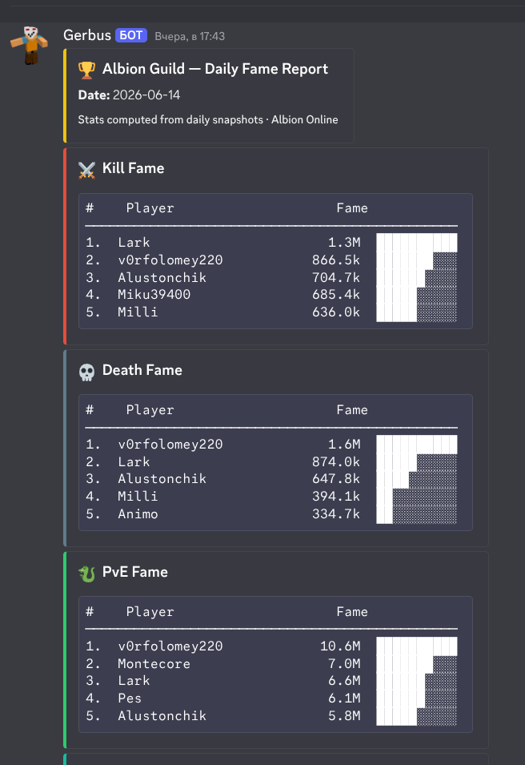
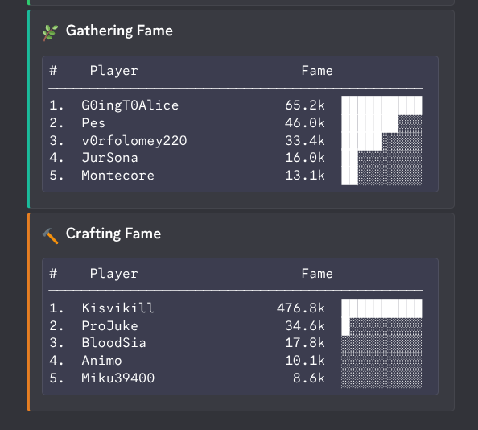
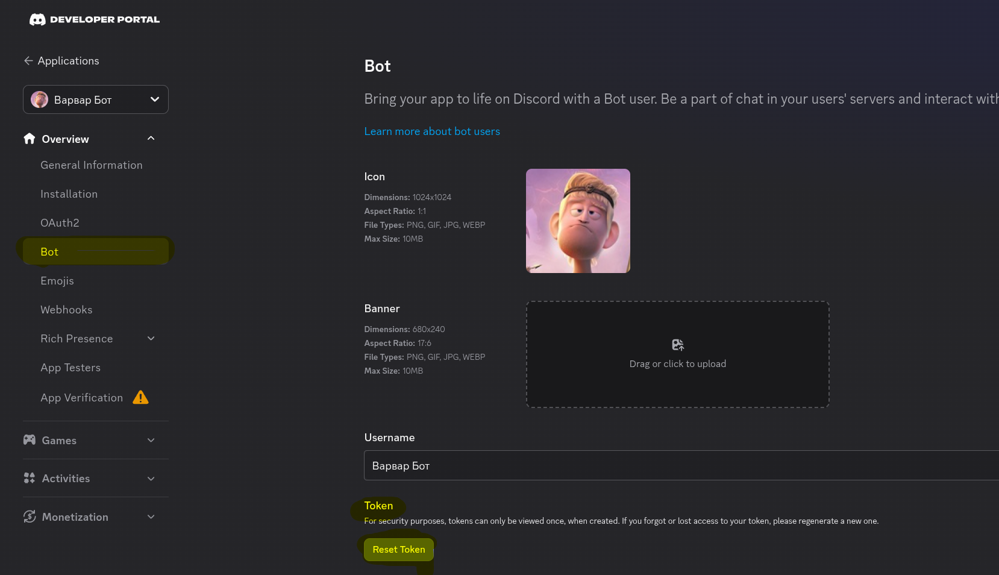
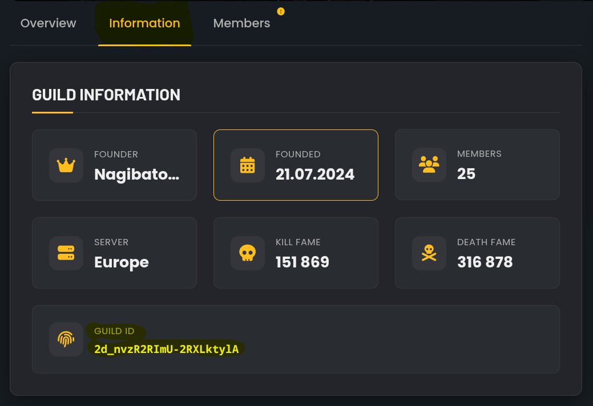
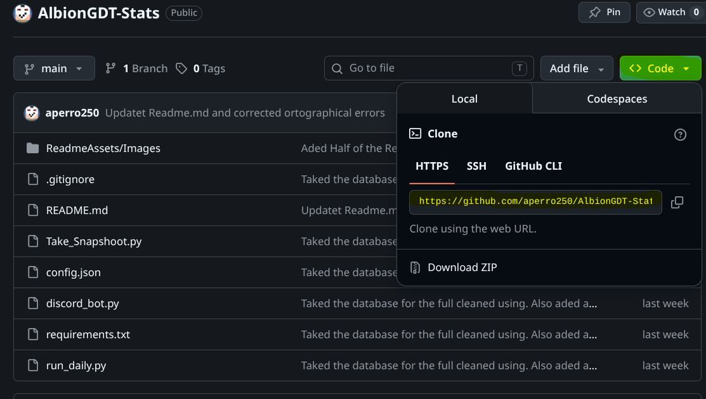
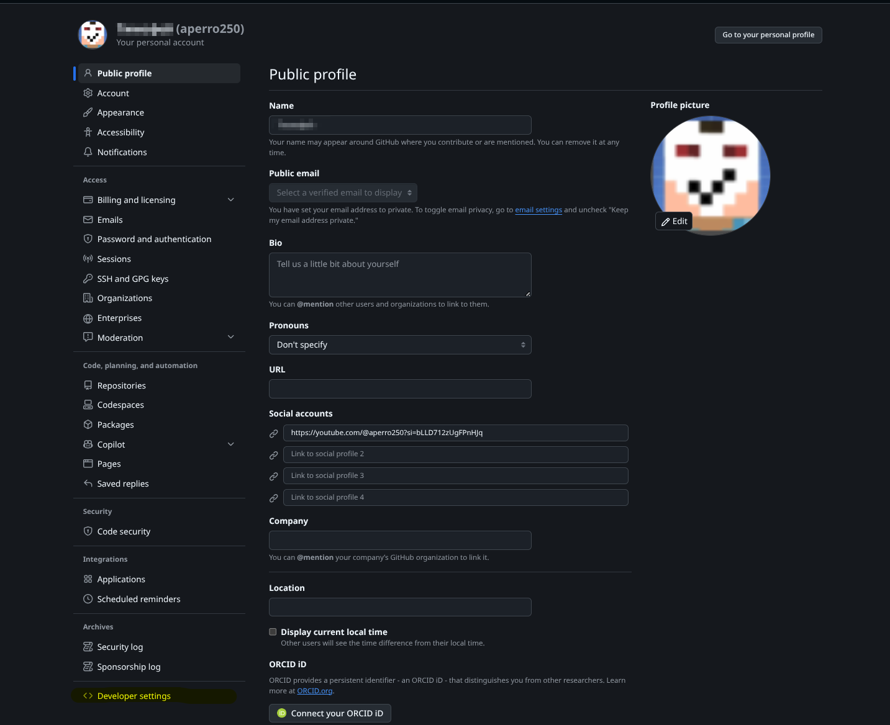
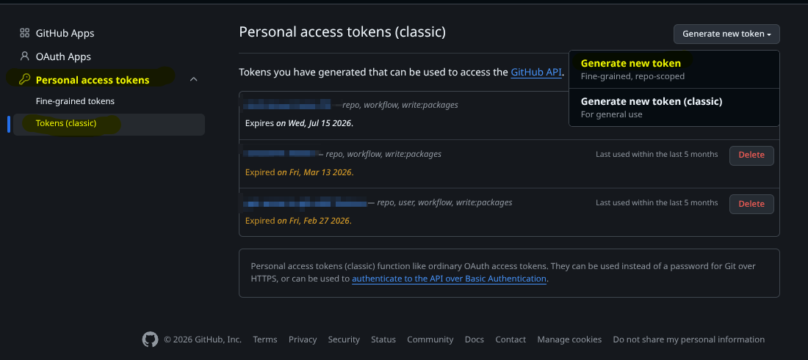
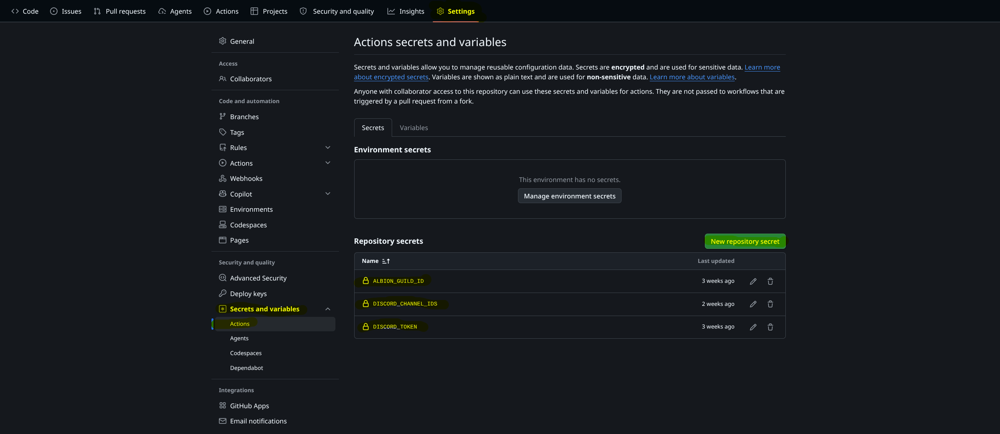
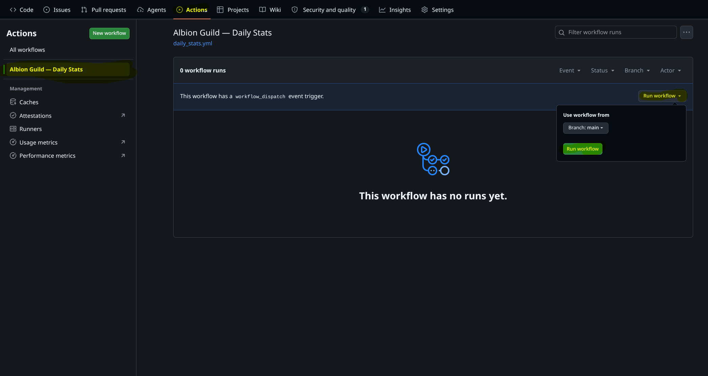

# 🎮 AlbionGDT-Stats

As the project name suggests, this project generates daily guild member statistics for Albion Online and sends them to a selected Discord channel.

<table>
  <tr>
    <td valign="top">
      
    </td>
    <td valign="bottom">
      
    </td>
  </tr>
</table>

# 👁️‍🗨️ Project Overview

There used to be a Discord bot called Albion Tools that sent daily information about guild members, but it currently has server issues and does not work.

As a solution, I investigated ***where it obtained the data*** and wrote this project to create a fully automatic and **FREE** Discord bot that sends daily statistics to a selected Discord channel. I will explain below in the installation guide how it works and where the data comes from, in case you want to investigate or are simply interested in the code.

# ❗ IMPORTANT

***This project manages current information, and the data in the database is from yesterday, so the daily statistics are not for today — they are for yesterday!***

***On the first day there will be no statistics message, because the program needs a minimum of 2 days to collect all the necessary data to work. Statistics will be available from the second day onward.***

# 1. 🛠️ Installation Guide

## 1.1 ⏬ Download

**Clone this repository** from GitHub:

```bash
git clone https://github.com/aperro250/AlbionGDT-Stats.git
cd AlbionGDT-Stats
```

Now install the required Python packages *(discord.py and requests)*. They are listed in **requirements.txt**:

```bash
pip install -r requirements.txt
```

### 🔴 error: externally-managed-environment

If you get the error **error: externally-managed-environment**, you must create a virtual Python environment and run all commands inside it. To create it, run:

```bash
python -m venv venv
```

Then activate the environment. **IMPORTANT:** if you restart the console, you need to run this command again to use the installed Python packages.

**WINDOWS**

```bash
source venv/Scripts/activate
```

**LINUX**

```bash
source venv/bin/activate
```

Now run the pip install command from before.

# 2. ⚙️ Configuration

Once everything is installed, let's configure the project.

Locate the file **config.json**, which contains the configuration.

Here is the file syntax:

```json
{
    "discord_token": "DISCORD_TOKEN",
    "guild_id": "ALBION_GUILD_ID",
    "channels": {
        "rating": [
            FIRST_DISCORD_CHANNEL_ID,
            SECOND_DISCORD_CHANNEL_ID,
            ...
        ]
    }
}
```

Multiple Discord channels are supported, but the project also works with just one — the others are optional.

### 2.1 🤖 Obtain a Discord Bot Token

Go to the [Discord Developer Portal](https://discord.com/developers/home) and create a new bot or use an existing application.

After it is created, go to your application and open the **Bot** settings section. Find the **Token** section and click the regenerate button. Copy the token and paste it into the config file.



To use the bot, you also need to invite it to your server. Go to the **OAuth2** section, open the **URL Generator**, select **bot** as the scope, and grant it the permission to **send messages in text channels**. Copy the generated URL, open it in your browser, and invite the bot to your server.

### 2.2 📋 Obtain the Albion Online Guild ID

To obtain your guild ID, I recommend using an external source. I used [Albion Online Tools](https://albiononlinetools.com/) — you can [search for your guild](https://albiononlinetools.com/player/guildfinder.php) and find the guild ID in the information section.



### 2.3 🗨️ Obtain a Discord Channel ID

***This is optional — the bot can configure this automatically using the `/set-channel` command.***

You can obtain the Discord channel ID by right-clicking the channel and selecting **"Copy Channel ID"**.

# 3. 🐍 Running the Code

Once all requirements and the configuration file are ready, you can run the project. It has 2 individual entry points and 1 that runs everything at once.

### 3.1 ▶️ Main Run File (run_daily.py)

This is the file you will run most often. It first runs **Take_Snapshoot.py** to fetch the latest guild data, then runs **discord_bot.py** in headless mode to send the statistics to all channels listed in config.json.

```bash
python run_daily.py
```

### 3.2 1️⃣ Update the Database / Take a Snapshot (Take_Snapshoot.py)

This script updates the database (albion_guild_stats.db) and calculates the daily delta — the difference between today's and yesterday's stats — to obtain the daily statistics.

```bash
python Take_Snapshoot.py
```

You can also open the database to view the full history. It is an SQLite database and can be opened with any graphical SQLite viewer. I used **DB Browser for SQLite**, but any compatible tool will work.

### 3.3 2️⃣ Launch the Discord Bot (discord_bot.py)

This script starts the Discord bot. If you run it directly, it will keep running and listen for slash commands. If it is started from run_daily.py, it will only run long enough to send the statistics and then exit.

```bash
python discord_bot.py
```

Once the bot is active, type `/` in any channel and select the bot to view its available commands:

***/send-daily-stats***

Sends the daily statistics to the channel where the command was executed. It does not update the database, so make sure the snapshot has been taken first.

***/set-channel report_type:rating***

Adds the current channel to the list of destinations where daily statistics will be sent automatically. **This appends to the list instead of overwriting it.**

***/set-guild-id guild_id:YOUR_GUILD_ID***

Sets the provided ID as the guild to fetch information from. **THIS WILL REPLACE THE PREVIOUS GUILD ID.**

# 4. 🔄 Automation

Now that the code is running correctly locally, let's make it run automatically every day using GitHub Actions — completely free.

### 4.1 ☁️ Upload the Code to a GitHub Repository

🟢 The **EASIEST** way is to fork this public repository to your account, which will create an identical copy. If you choose this method, skip the next section.

🟡 If you cloned the repository to your local machine and want to upload it to your own GitHub account as a new repository, follow these steps:

1. Go to GitHub and create a new repository. For personal use, I recommend making it private so confidential information stays safe.

2. Open a terminal in your project directory and run the following commands:

   Initialize the Git structure:

   ```bash
   git init
   ```

   Add all files and make an initial commit.
   
   **❗ IMPORTANT ❗** If there are files you do not want to upload to GitHub, create a file called **.gitignore** in the project folder and list them there (for example, config.json if it contains sensitive information). **DO NOT add the database file** to .gitignore, or a new empty database will be created on each run and there may be push conflicts.

   ```bash
   git add .
   git commit -m "Initial commit"
   ```

   Now link your local project to the online repository. Go to the repository page on GitHub and copy its URL.

   

   Then run these commands, replacing `URL` with your repository URL:

   ```bash
   git remote add origin URL
   git branch -M main
   git push -u origin main
   ```

   When prompted, enter your GitHub **username (your email)** and a **personal access token** as the password (not your account password). You can create a classic token in your GitHub developer settings.

   
   

   From now on, whenever you make changes and want to update the online repository, just commit and push:

   ```bash
   git push
   ```

### 4.2 🔓 Create Repository Secrets

If you do not want to upload confidential information to the internet, this step is for you. If you made a private repository and already uploaded a config.json with all the required information, you can skip this step.

The project also supports GitHub Repository Secrets as an alternative to config.json. Go to your repository page, open **Settings**, find the **Secrets and variables** section, and select **Actions**. Create the following 3 secrets:

```
ALBION_GUILD_ID      ← The Albion guild ID. See step 2.2 to obtain it.
DISCORD_TOKEN        ← The Discord bot token. See step 2.1 to obtain it.
DISCORD_CHANNEL_IDS  ← The Discord channel ID. If there are multiple, separate them with a comma. See step 2.3 to obtain them.
```



### 4.3 📝 Configure GitHub Actions Workflow

This is the final step — congratulations for making it this far!

Go to your repository on GitHub, navigate to the **Actions** tab, and select the existing workflow: **Albion Guild — Daily Stats**. Then click **Run workflow** to trigger it manually for the first time.



The workflow will run on GitHub's virtual machines and will: install all dependencies, apply the repository secrets (or fall back to config.json if secrets are not set), update the database, send the daily statistics to all configured channels, commit the updated database, and push the changes back to the repository.

From the next day onward, the workflow will run automatically **at 10:00 UTC**. There may be some delay due to high traffic on GitHub's servers — this is normal, so please be patient.

If you want to sync your local files with the latest database committed by the bot, run:

```bash
git pull
```

# 5. 🗄️ (Optional) Manage the Database

- This section is in progress.

# 6. ⚠️ Common Issues

- This section is in progress.
